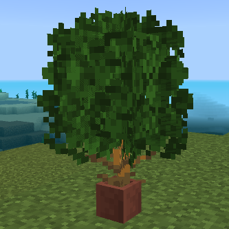
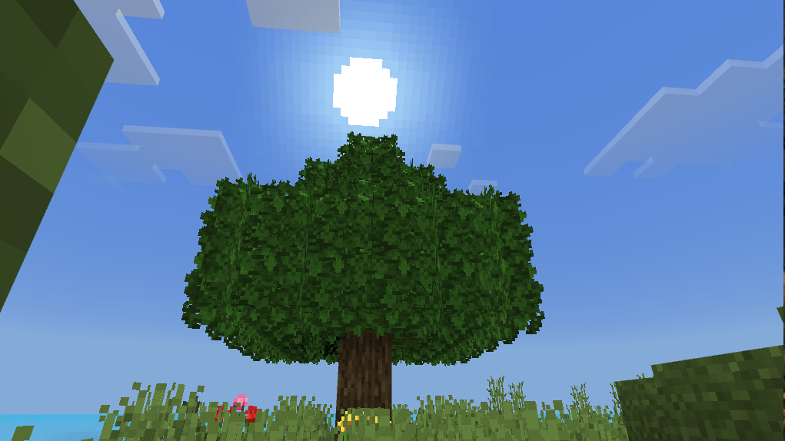
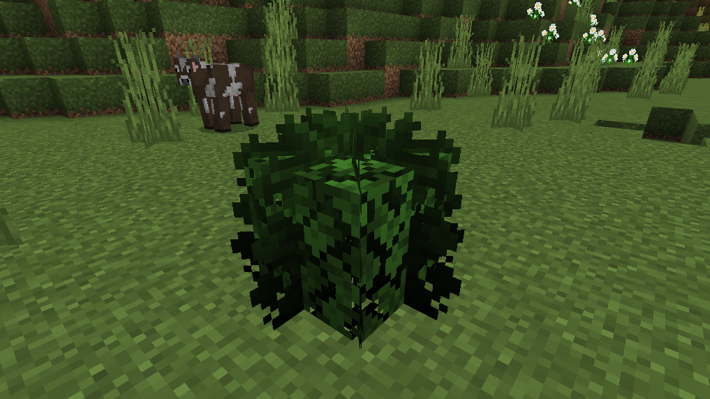
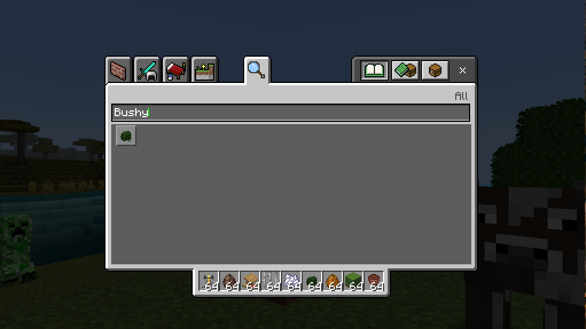
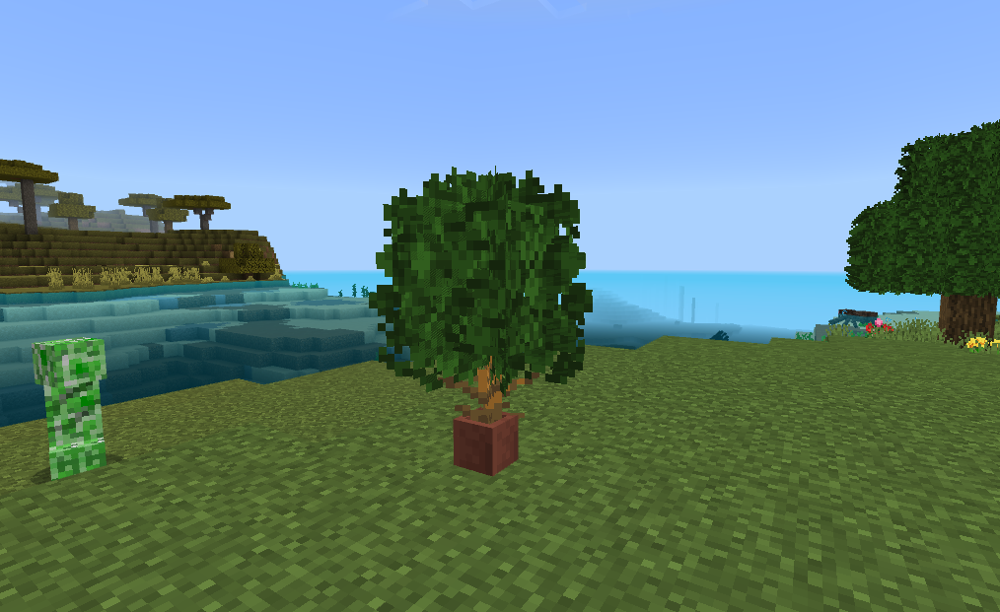

# Het's Bushy Leaves For Minecraft: Bedrock `1.19.0`

Now finally Bedrock players can have fun with bushy leaves mod just like Java players.

How it looks on a tree.

> **Warning**
> I have used Vanilla Tweaks on full grass block and better flower mod

Separately as a block.

To Get it just search `Bushy Leaves` in search bar of the inventory in Creative mode.

> **Note**
> ToDo: Add recipe support soon

## Life Hack

Place a dead bush in a pot and just put bushy leaves on top

